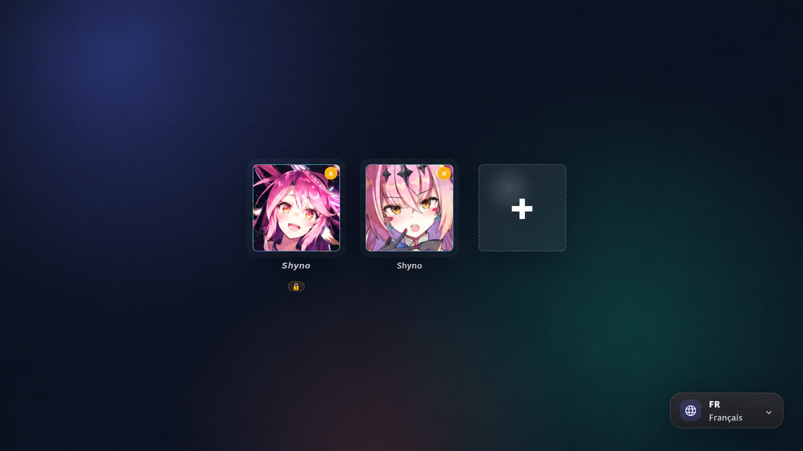
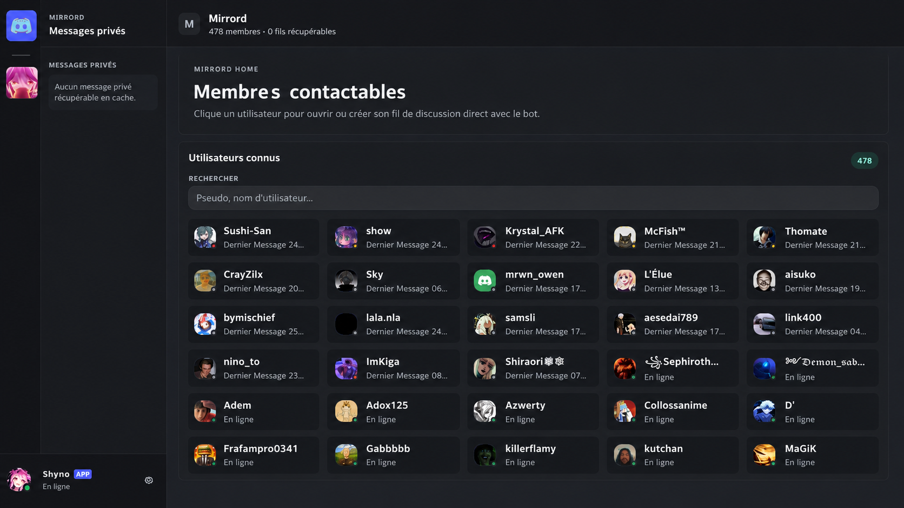
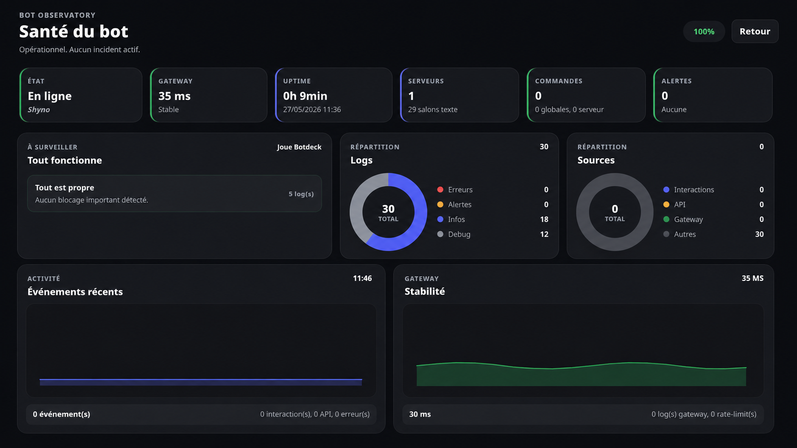
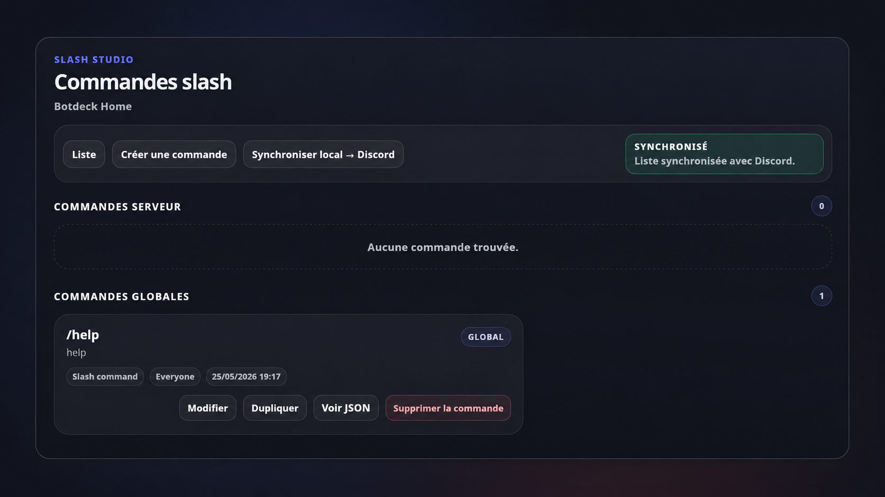

<p align="center">
  
</p>

<h1 align="center">
  <strong>Botdeck</strong>
</h1>

---

<p align="center">
  🤖 All-in-one workspace for managing Discord bots, servers, commands, automations and monitoring.
</p>

<p align="center">
  <a href="https://github.com/Nullmess/Botdeck/stargazers">
    
  </a>
  <a href="LICENSE">
    
  </a>
  
</p>

| Bot setup | Workspace |
| --- | --- |
|  |  |

| Runtime health | Slash command studio |
| --- | --- |
|  |  |

---

## ✨ Features

- Manage multiple Discord bots locally
- Discord-style workspace
- Send, edit and inspect messages
- Create embeds with live preview
- Build and test slash commands
- Configure templates and automations
- Inspect channels, roles, permissions and server state
- Search indexed messages with SQLite
- Monitor runtime health
- Configure local HTTPS/TLS
- Read-only mode for safer inspection
- Discord bot tokens encrypted at rest
- Local API protections against cross-site requests
- Authenticated WebSocket access with origin checks
- Security headers and CSP
- Rate limiting for sensitive actions
- Server-side read-only protections
- Security audit logs stored in `.botdeck/audit/security-audit.jsonl`

---

## 🚀 Usage

Botdeck recommends **Node.js 24.17.0** and **npm >=10 <12**.

Supported Node.js versions:

```text
>=22.16.0 <25
```

Install dependencies:

```shell
npm ci
```

Generate the Prisma client and apply local database migrations:

```shell
npm --prefix apps/web run db:generate
npm run db:migrate
```

Start development mode:

```shell
npm run dev
```

Open the web interface:

```text
http://localhost:3000
```

Start the desktop app:

```shell
npm run app
```

Run release checks:

```shell
npm run check
npm run build
npm run audit:prod
npm run package:check
```

Build platform packages:

```shell
npm run build-win
npm run build-lin
npm run build-mac
npm run build-all
```

---

## 👤 Author

Give a ⭐️ if Botdeck helped you!

---

## 📄 License

Copyright © 2026 [Nullmess](https://github.com/Nullmess).<br />
This project is licensed under the [MIT License](LICENSE).
